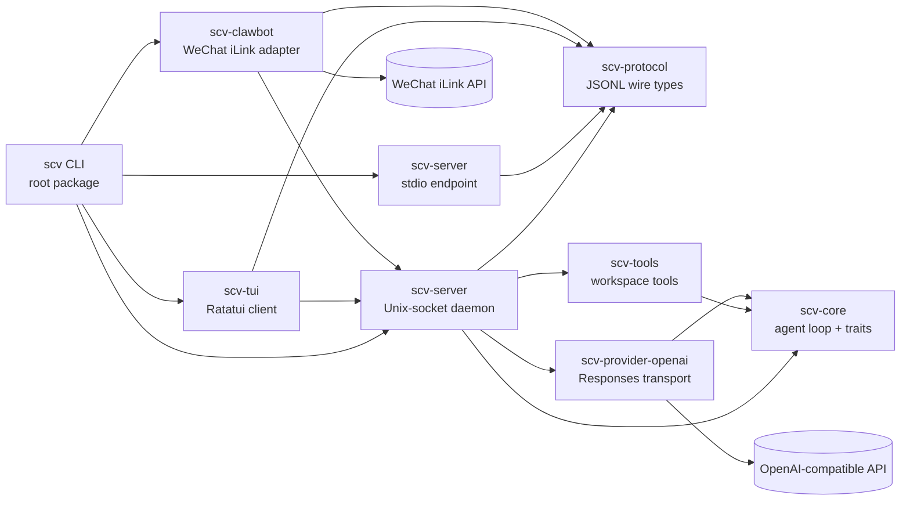

# SCV Architecture

Status: current v0.1 architecture

SCV is a small Rust agent runtime with a terminal client. Its core is useful for
coding work, while its provider, context, tool, approval, and event interfaces
are general enough to host other kinds of agents.

## Product boundary

SCV v0.1 provides:

- a provider-independent agent loop with bounded tool iterations;
- an OpenAI-compatible Responses API provider;
- configurable, deterministic context budgeting and compaction;
- built-in `read`, `read_skill`, `write`, `bash`, `agent_claude`,
  `agent_codex`, and `agent_pi` tools;
- a versioned newline-delimited JSON protocol;
- one Unix-socket daemon that owns agent state and per-connection sessions;
- a TUI and ClawBot bridge that attach to the daemon through the same protocol;
- interactive approval for tools with filesystem, shell, or subprocess side
  effects;
- Linux and macOS source builds and release archives.

The current release does not include dynamic library loading, OS-level
sandboxing, session resume, provider login, image input, syntax-highlighted
diffs, or feature parity with mature coding agents. Those features may be added
without moving policy or model-provider code into the TUI.

## Workspace layout

The repository is one Cargo workspace with these packages:

| Package | Responsibility |
| --- | --- |
| `scv-protocol` | Wire messages and the protocol version. It contains no runtime policy. |
| `scv-core` | Agent loop, conversation model, provider/tool/context traits, approvals, and event sink. |
| `scv-provider-openai` | Streaming OpenAI-compatible Responses transport. |
| `scv-tools` | Workspace-scoped file tools, shell execution, and native-agent delegation. |
| `scv-server` | Configuration, session lifecycle, protocol dispatch, cancellation, approval routing, and stdout event serialization. |
| `scv-tui` | Terminal state, rendering, input editing, scrolling, approval prompts, and the stdio client. |
| `scv-clawbot` | WeChat iLink authentication, polling, durable delivery state, and daemon-session adapter. |
| root `scv` package | Installable `scv` and `scv-server` binaries. |

Dependencies point inward: binaries and adapters depend on the server/client
interfaces; the server depends on core, tools, provider, and protocol; tools and
providers depend on core; core contains no concrete transport, provider, tool,
server, or TUI dependency; and the protocol package stays dependency-light. No
core package imports TUI or adapter code.

`scv-clawbot` is an external-client adapter. It speaks the versioned protocol
over the Unix-socket daemon, using one long-lived session per remote sender.
Session policy, history, queueing, cancellation, and approvals remain
authoritative in `scv-server`.

## Dependency diagram

The diagram shows compile-time crate dependencies and the runtime direction of
client connections. Arrows point from a dependent crate or process toward the
crate or service it uses.

The daemon and stdio endpoint share the same server implementation. The
Unix-socket daemon is the normal long-running backend; the stdio endpoint is a
one-session local transport for embedding and headless commands. TUI and
ClawBot connections create independent sessions, so provider and model
overrides are resolved at `session.start` without restarting the daemon.

## Runtime topology

The Unix-socket daemon owns one independent session and ordered queue for each
client connection. The default `scv` TUI attaches to that socket and reports a
clear not-started error when no daemon is listening. `server --stdio` remains
available for one-shot local clients such as `scv exec`.

Each `session.start` request can carry provider, model, and base-URL overrides.
The daemon resolves those values when creating the session, so model/provider
selection can change between TUI clients without restarting the daemon or
mutating another session's runtime. Queue state survives neither client
disconnect nor server restart.

The managed daemon is started as a user-level systemd service and defaults to
the `on-risk` approval policy. `scv start --allow-sudo` may authenticate the
current user's existing sudo policy before the service starts, but SCV does not
modify sudoers or elevate the daemon itself. A start without verified sudo
authorization is confirmed interactively, or rejected when no terminal is
available.

## Agent loop

For each user turn, the server-owned session performs this sequence:

1. Append the user message to the full session history.
2. Ask the configured context policy for the model-visible history.
3. Send the system prompt, selected history, and current tool schemas to the
   provider.
4. Emit assistant text deltas while accumulating the canonical assistant
   message, then append that complete message.
5. If the message contains tool calls, approve and execute them in call order,
   append their bounded results, and return to step 2.
6. Finish when the provider returns no tool calls. Cancellation produces a
   cancelled terminal event; provider, invariant, and configured resource-limit
   failures produce a failed terminal event.

If `agent.max_steps` is reached before a final response, the loop stops before
another provider request and reports `step_limit` without executing more work.

A tool failure is a model-visible tool result rather than a server crash. A
provider, protocol, or invariant failure ends only the current turn when
possible. Canonical history is bounded by session byte and message limits.
Before a limit is reached, the server replaces the oldest complete groups with
one bounded deterministic history note and emits `session.trimmed`. It never
splits an assistant/tool group. If the active turn alone cannot fit, the turn
fails with `history_limit`. Any failed or cancelled turn restores its pre-turn
history snapshot, so canonical history never retains a partial or oversized
active group.

## Extension surface

Rust traits are the stable internal extension seam:

- `Provider` converts a model request into one assistant message and usage;
- `Tool` publishes a JSON schema, an approval risk, and asynchronous execution;
- `ContextPolicy` selects or compacts model-visible history;
- `ApprovalGate` resolves side-effecting work;
- `EventSink` receives typed lifecycle events.

`ToolRegistry` accepts built-in or downstream `Arc<dyn Tool>` values without
changes to the loop. `AgentRuntime` is constructed from trait objects so another
binary can embed SCV with different providers, policies, and tools.

Process extensions use the same internal adapter behind `agent_claude`,
`agent_codex`, and `agent_pi`. Adapters are declarative
executable-plus-argument templates. SCV does not load third-party dynamic
libraries in v0.1 because Rust has no stable dylib ABI and in-process plugins
would share all of SCV's authority.

Skills are Markdown instruction packages discovered from `.scv/skills/*/SKILL.md`
and the configured user skill directory. The v0.1 loader exposes their name and
description in the system prompt. The model loads an applicable skill by name
through `read_skill`, which resolves only the immutable discovery map and checks
containment under the configured skill roots. A skill does not gain authority
beyond the tools and approvals available to the session.

## Provider boundary

The built-in provider uses the OpenAI-compatible `/responses` endpoint and
function-tool schema. It assembles streamed tool-call arguments and validates
the final JSON before returning a call to the loop. The base URL, API-key
environment variable, model, and timeout are configuration. API keys are read
from the environment and never accepted in project configuration.

The core `Provider` trait does not expose HTTP types. Native Anthropic,
Responses API, local-model, streaming, and subscription-auth providers can be
added independently.

## TUI contract

The TUI keeps no authoritative conversation or tool state. It connects to the
daemon socket, renders server events, and sends protocol commands. Its current
interaction contract is:

- a persistent transcript, multi-line composer, status line, and model/context
  footer;
- `Enter` to submit and `Ctrl+J` to insert a newline;
- `Esc` to cancel the active turn and `Ctrl+C` to clear input or quit when the
  input is empty;
- `PageUp`/`PageDown` scrolling;
- visible, collapsible tool lifecycle rows with bounded result previews;
- an explicit `y`/`n` approval prompt that includes the tool name, risk, working
  directory, and summary;
- prompt history and `/help`, `/clear`, `/context`, and `/quit` local commands;
- terminal restoration after normal exit, errors, panics, and child shutdown.

Queued steering, file completion, session trees, model pickers, images, themes,
and rich Markdown are follow-up UX layers on the same event protocol.

## Portability and installation

The supported source toolchain is stable Rust 1.88 or newer. Runtime code uses
portable Rust APIs plus `/bin/bash` on Linux and macOS. The release
matrix builds `aarch64` and `x86_64` archives for both operating systems.

The primary installation paths are a GitHub Release archive and
`cargo install --locked --git <repository-url>`. The root package installs both
executables. SCV does not modify shell profiles or install provider CLIs.

## Verification and performance budgets

Every change must pass `cargo fmt --check`, `cargo clippy --workspace
--all-targets --locked -- -D warnings`, `cargo test --workspace --locked`, and
`git diff --check`. Protocol and tool safety behavior require unit or
integration coverage.

The full correctness and performance plan is defined in
[`quality.md`](quality.md). Tests use scripted providers and fake executables;
they never require a live API key or an installed delegated agent.

The benchmark harness measures operations SCV controls rather than provider
latency. On a release build and warm filesystem, the targets are:

- context selection over 10,000 small messages: under 20 ms;
- protocol encode/decode round trip: under 100 microseconds per message;
- release binary startup through protocol initialization: under 150 ms on a
  contemporary developer laptop, reported as an observed value rather than a
  cross-machine test failure.

Benchmarks use Criterion where statistical sampling is useful. Manual release
smoke measurements cover process startup, first paint, and memory. CI checks
correctness; performance results are recorded for regression comparison because
shared runners are noisy.

## Reference baseline

SCV's boundaries are informed by primary project documentation:

- [Codex app-server protocol](https://github.com/openai/codex/blob/main/codex-rs/app-server/README.md)
  demonstrates a typed, bidirectional server boundary for multiple clients.
- [Codex protocol crate](https://github.com/openai/codex/blob/main/codex-rs/protocol/README.md)
  keeps protocol types light and free of material business logic.
- [Pi coding agent](https://github.com/earendil-works/pi/blob/main/packages/coding-agent/README.md)
  demonstrates a small default toolset, multiple runtime modes, session context
  compaction, and a terminal-first interaction model.
- [Pi extensions](https://github.com/earendil-works/pi/blob/main/packages/coding-agent/docs/extensions.md)
  demonstrates tool registration and lifecycle interception as explicit
  extension surfaces.
- [Claude Code documentation](https://code.claude.com/docs/en/overview)
  is the UX reference for visible tool activity, interruption, permissions,
  project instructions, and terminal-centered workflows.

These are behavioral and architectural references. SCV contains no copied
source code from them.

User configuration supports named provider profiles with per-profile endpoints,
credentials, and headers; project configuration cannot redirect that trust
boundary.
