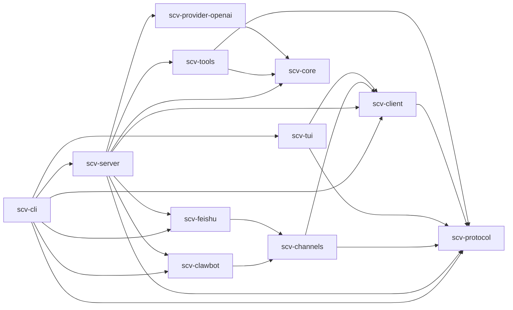

# SCV Architecture

Status: current v0.1 architecture

SCV is a small Rust agent runtime with a terminal client. Its core is useful for
coding work, while its provider, context, tool, approval, and event interfaces
are general enough to host other kinds of agents.

## Dependency diagram

Arrows show compile-time dependencies from a crate to the crate it uses.
Runtime socket connections are described below and do not add a client-to-server
crate dependency.

## Product boundary

SCV v0.1 provides:

- a provider-independent agent loop with bounded tool iterations;
- an OpenAI-compatible Responses API provider;
- configurable, deterministic context budgeting and compaction;
- built-in `read`, `read_skill`, `write`, `bash`, `web_fetch`, `web_search`,
  `agent_claude`, `agent_codex`, `agent_grok`, `agent_dsh`, and `agent_pi`
  tools, plus the provider's hosted web search when configured;
- a versioned newline-delimited JSON protocol;
- one Unix-socket daemon that owns agent state and per-connection sessions;
- a TUI and chat channel bridges (WeChat) that attach to the daemon through the
  same protocol;
- interactive approval for tools with filesystem, shell, subprocess, or
  network side effects;
- Linux and macOS source builds and release archives.

The current release does not include dynamic library loading, OS-level
sandboxing, session resume, provider login, image input, syntax-highlighted
diffs, or feature parity with mature coding agents. Those features may be added
without moving policy or model-provider code into the TUI.

## Workspace layout

The repository is one Cargo workspace with these packages:

| Package | Responsibility |
| --- | --- |
| `scv-protocol` | Wire messages and the protocol version. It contains no runtime policy. |
| `scv-client` | The instance layout (`Layout`: every path under `SCV_HOME`), the default socket path, and a bounded daemon control helper; depends on protocol, not server. |
| `scv-core` | Agent loop, conversation model, provider/tool/context traits, approvals, and event sink. |
| `scv-provider-openai` | Streaming OpenAI-compatible Responses transport. |
| `scv-tools` | Workspace-scoped file tools, shell execution, and native-agent delegation. |
| `scv-server` | Configuration, session lifecycle, component supervision, protocol dispatch, cancellation, approval routing, and event serialization. |
| `scv-tui` | Terminal state, rendering, input editing, scrolling, approvals, socket client, and headless stdio client. |
| `scv-channels` | The bridge every chat channel shares: the `Transport` trait, durable claims and delivery state, held replies, per-conversation daemon sessions and limits, owner-only remote tools, and background reports. |
| `scv-clawbot` | The WeChat channel: iLink authentication, polling, and sending behind `Transport`, and its credentials. |
| `scv-feishu` | The Feishu/Lark channel: app registration by QR scan, the event long connection with catch-up from chat history, and sending behind `Transport`, and its credentials. |
| root `scv-cli` package | Installable `scv` and `scv-server` binaries. |

The integration dependency chain is
`server -> clawbot|feishu -> channels -> client -> protocol`.
The TUI depends on client and protocol, never server. Tools and providers depend
on core, and tools also on protocol, whose wire types `agent_scv` speaks to a
nested SCV; core contains no concrete transport, provider, tool, server, or TUI
dependency. Protocol remains dependency-light. All packages share version
`0.2.0` and exact workspace dependency pins.

Each channel account is a component hosted by the daemon's supervisor. A
channel crate (WeChat's `scv-clawbot`, Feishu's `scv-feishu`) implements
`scv-channels::Transport`: it signs in, receives a batch of messages after a
checkpoint, and sends one part of a message. A push transport such as Feishu's
acknowledges a batch when the bridge asks for the next one, which it does only
after the batch's claims and checkpoint are durable. `scv-channels::run` does the rest for every channel. It
speaks the versioned protocol over the daemon socket, using one long-lived
session per remote sender (and per group and sender in group chats). Sessions
are tool-free unless the account's `remote_tools = "owner"` setting grants the
authenticated owner's direct chats full, auto-approved tools.
Session policy, history, queueing, cancellation, and approvals remain
authoritative in `scv-server`. See [`channels.md`](channels.md) for its API,
storage, delivery, and safety contract.

The daemon and stdio endpoint share the same server implementation. The
Unix-socket daemon is the normal long-running backend; the stdio endpoint is a
one-session local transport for embedding and headless commands. TUI and
channel connections create independent sessions, so provider and model
overrides are resolved at `session.start` without restarting the daemon.

## Runtime topology

The Unix-socket daemon owns one independent session and ordered queue for each
client connection. The default `scv` TUI attaches to that socket and reports a
clear not-started error when no daemon is listening. `server --stdio` remains
available for one-shot local clients such as `scv exec`.

Each `session.start` request can carry provider, model, and base-URL overrides.
The daemon resolves those values when creating the session, so model/provider
selection can change between TUI clients without restarting the daemon or
mutating another session's runtime. Queue state survives neither client
disconnect nor server restart.

The managed daemon is started as a user-level systemd service and defaults to
the `on-risk` approval policy. `scv start --allow-sudo` may authenticate the
current user's existing sudo policy before the service starts, but SCV does not
modify sudoers or elevate the daemon itself. A start without verified sudo
authorization is confirmed interactively, or rejected when no terminal is
available.

`scv update` installs the latest CLI from the configured Cargo index and
restarts an active user daemon through systemd. The socket closes as the old
process exits; TUI clients retry the socket and establish a new session after
the replacement daemon is ready. Canonical history and the queue belong to the
old server session and are not restored. The TUI never automatically replays
submitted work. A foreground `scv run` daemon requires an explicit restart
after installing the published binary.

## Component lifecycle

`scv-server::components` owns `Component`, `HealthReporter`, and `Supervisor`.
`Component::run(cancel, HealthReporter)` must observe cancellation and must not
detach child tasks. The supervisor starts at most one instance per account,
retries unexpected exits with exponential backoff from 1 to 60 seconds, and
cancels, aborts if necessary, and joins work within bounded shutdown.
All future long-running components must use this server-owned lifecycle.

The daemon discovers saved channel accounts on startup and reconciles every
two seconds or immediately on `scv reload`. Each account is the component
`<channel>:<account>`. Login is explicit; saved accounts
autostart unless their `[channels.<channel>.<account>]` table in `config.toml`
disables them. Each account's optional
workspace defaults to the daemon workspace. Credential or settings replacement
stops and joins the old instance before starting its replacement. Logout
requires a live daemon, disables and joins the component, then removes its
credentials, delivery state, and settings table.

Reconciliation runs in a separate cancellation-aware task, leaving the listener
free to accept connections. `state::account_snapshot` reads credentials and
settings together under the account transaction lock. Delivery state is bound
to identity and normalized API origin; same-identity token rotation preserves
state, while changing the binding requires logout. Unknown legacy identity uses
a conservative token-based fingerprint. The lifetime runner lock and short
mutation lock are nonblocking, and no network I/O holds the mutation lock.
A busy account snapshot defers reconciliation without stopping the running
instance.

SIGTERM and Ctrl+C stop acceptance, cancel components and tracked session tasks,
and join them with bounded cleanup. A `TaskTracker` retains session writer and
turn tasks through forced connection-handler aborts; abort guards and turn
cancellation ensure descendants stop, and shutdown waits for their completion.
The stdio endpoint does not host components.
Management uses `daemon.control` and `daemon.status` on the daemon socket through
`scv-client`; it does not require an agent session. Status reports the running
server PID/version, account identity, component state, last successful contact,
restart count, and sanitized errors. Credentials are not connection evidence.
The component management lock is released before writing the response, so a
nonreading management client cannot prevent reconciliation or shutdown.

Delegated agent runs are tracked by `scv_tools::delegation`. Each SCV process
(the daemon or a `scv server --stdio`) holds one `DelegationRegistry` for its
instance, and every session's agent tools record their runs in it through
`ToolsConfig.delegation`, which carries the registry and the session ID.
Records live in `$SCV_HOME/state/delegations`, so the daemon also sees runs that
`scv exec` servers started. A separate daemon task reconciles them at startup
and every 60 seconds, stopping orphans, and collects exited orphan processes;
on Linux the daemon is a child subreaper. `delegations` and `delegation_kill`
control actions serve `scv agents ps` and `scv agents kill`. A session whose
client declares `session.start.delegation_depth` (a delegated client) counts
its runs from that depth when it exceeds the process's own.

Live delegations keep one child for a whole conversation. `scv_tools::live`
holds the protocol-neutral part: `LiveChild` starts the child in its adapter
environment and own process group, records it as a delegation, frames its
stdout into bounded lines, and shuts it down (stdin closed, a 2-second grace,
then a group kill and a sweep of tagged processes). The conversation store
keeps the child as the conversation's attachment, so forgetting, expiring, or
ending the conversation's session is what shuts it down. `scv_tools::scv_agent`
runs the SCV protocol client on top of it for `agent_scv`, and
`scv_tools::acp_agent` runs an Agent Client Protocol (JSON-RPC 2.0) client on
the same runtime for the agents whose adapter-table entry names an ACP server
(`AcpLaunch`). The server resolves `[agents.<name>] transport` into an
`AcpAgentLaunch`, and the registry registers the ACP tool when that server is
installed, otherwise the per-turn CLI tool. Tools reach the session's approval
gate through `ToolContext.approvals`, which carries the running call's ID, so a
nested agent's approval requests are decided like the session's own.

Background delegations live in `scv_tools::background`. Each session owns one
`BackgroundJobs` store, shared by its tools and dropped with the session,
which cancels the jobs still running. When `agent.max_background` is positive
the registry wraps every agent tool in `BackgroundCapable`: a call with
`background: true` starts the wrapped tool's `execute` in a detached task with
its own cancellation token, a buffered progress sink, and the session's
unattended approval gate (the policy's own decision, else the client's
declared `auto_approve`, else a denial), and returns a job handle;
`agent_wait` and `agent_status` read the store and `agent_cancel` cancels one
job's token. Beneath it, `scv_tools::agent_choice::ChosenAgent` prefixes each
agent tool's description with its product and what it offers, appends the
user's `use_for`, and names the other offered agents on availability
failures. A
finished job wakes the connection loop, which, once the session is idle and
its queue empty, starts a turn of its own (`TurnStarter::report_background`)
whose prompt reports the jobs the model has not seen yet; its events carry a
`TurnOrigin`. The channel bridge routes such turns by `request_id`, keeps a session with
running jobs open (and exempt from eviction), and sends their answers as
unprompted messages. The system prompt's delegation and chat-channel sections
are built after the registry, from the agent tools it actually offers and the
`channel` the client declared.

A live child (`scv_tools::live::LiveChild`, behind the ACP and nested-SCV
transports) is owned by a reaper task that waits on the process from the
start, so a child that exits between turns, by itself or through `scv agents
kill`, is collected at once, its group stopped, and its delegation record
removed.

## Agent loop

For each user turn, the server-owned session performs this sequence:

1. Append the user message to the full session history.
2. Ask the configured context policy for the model-visible history.
3. Send the system prompt, selected history, and current tool schemas to the
   provider.
4. Emit assistant text deltas while accumulating the canonical assistant
   message, then append that complete message.
5. If the message contains tool calls, approve and execute them in call order,
   append their bounded results, and return to step 2. While a tool runs, the
   lines it reports to `ToolContext.progress` are forwarded as `ToolProgress`
   events at most every 500 ms; they are display-only and never enter the
   history.
6. Finish when the provider returns no tool calls. Cancellation produces a
   cancelled terminal event; provider, invariant, and configured resource-limit
   failures produce a failed terminal event.

If `agent.max_steps` is reached before a final response, the loop stops before
another provider request and reports `step_limit` without executing more work.

A tool failure is a model-visible tool result rather than a server crash. A
provider, protocol, or invariant failure ends only the current turn when
possible. The provider retries transient failures only before any output has
streamed, and reports every other error, including an error event or a stream
that ends before completion, as a failed turn rather than an empty answer. Canonical history is bounded by session byte and message limits.
Before a limit is reached, the server replaces the oldest complete groups with
one bounded deterministic history note and emits `session.trimmed`. It never
splits an assistant/tool group. If the active turn alone cannot fit, the turn
fails with `history_limit`. Any failed or cancelled turn restores its pre-turn
history snapshot, so canonical history never retains a partial or oversized
active group.

## Extension surface

Rust traits are the stable internal extension seam:

- `Provider` converts a model request into one assistant message and usage;
- `Tool` publishes a JSON schema, an approval risk, and asynchronous execution,
  and may report status lines through the `ProgressSink` in its context;
- `ContextPolicy` selects or compacts model-visible history;
- `ApprovalGate` resolves side-effecting work;
- `EventSink` receives typed lifecycle events.

`ToolRegistry` accepts built-in or downstream `Arc<dyn Tool>` values without
changes to the loop. `AgentRuntime` is constructed from trait objects so another
binary can embed SCV with different providers, policies, and tools.

Process extensions use the same internal adapter behind `agent_claude`,
`agent_codex`, `agent_grok`, `agent_dsh`, and `agent_pi`. Adapters are
declarative: one `scv_tools::adapters` descriptor per CLI holds its
executable-plus-argument templates, its state location inside the private
home, the variables it must not inherit, and how `scv agents` signs it in. SCV does not load third-party dynamic
libraries in v0.1 because Rust has no stable dylib ABI and in-process plugins
would share all of SCV's authority.

Skills are Markdown instruction packages discovered from `.scv/skills/*/SKILL.md`
and the configured user skill directory. The v0.1 loader exposes their name and
description in the system prompt. The model loads an applicable skill by name
through `read_skill`, which resolves only the immutable discovery map and checks
containment under the configured skill roots. A skill does not gain authority
beyond the tools and approvals available to the session.

Repositories carry their own agent skills in `.agents/skills` (Codex) and
`.claude/skills` (Claude Code). SCV does not execute or translate them: in
tool-enabled sessions it lists those of the workspace and its immediate child
projects as `<project>:<name>` so the model knows they exist, and delegates the
work with an `agent_*` call whose `cwd` is that project. The nested CLI then
discovers the project's instructions and skills natively, so new repositories
and skills need no SCV registration.

## Provider boundary

### Instance configuration boundary

An SCV process owns one immutable instance root selected by `--scv-home` or
`SCV_HOME` (default `~/.scv`). The root is the namespace for configuration,
socket, service unit identity, skills, credentials, channel state, and nested
agent state, laid out by `scv_client::Layout` as `config.toml`,
`credentials/`, `agents/`, `skills/`, and `state/` (see
[instance layout](configuration.md#instance-layout)); every crate takes its
paths from `Layout` rather than joining its own. `--config`/`SCV_CONFIG` selects an explicit additional config
layer for that instance. Custom roots never fall back to the default user
configuration, allowing forked SCV processes to choose different providers and
models without sharing mutable state. The systemd launcher persists the
selectors and `scv update` restarts only the selected instance.

Native agent adapters receive a derived private home under
`<instance>/agents/<name>`. Codex receives the matching `CODEX_HOME`; SCV
also removes SCV selector variables from the child environment. This prevents
an SCV adapter from reusing or changing the user's normal Codex configuration.

The built-in provider uses the OpenAI-compatible `/responses` endpoint and
function-tool schema. It assembles streamed tool-call arguments and validates
the final JSON before returning a call to the loop. Requests are stateless: each
one replays the conversation, with every earlier tool call sent as a
`function_call` item before its `function_call_output`. A call whose turn was
cancelled before it returned is closed with a failed output, so the replayed
history always pairs calls with results as the API requires. Function tools are
sent with `strict: false`: SCV schemas leave optional fields out of `required`,
and strict mode, the Responses default, would make the model fill every one of
them, such as an unrequested `model` or `effort` for a delegated agent.

The base URL, API-key environment variable, model, and timeout are
configuration. API keys are read from the environment and never accepted in
project configuration.

The core `Provider` trait does not expose HTTP types. Native Anthropic,
Responses API, local-model, streaming, and subscription-auth providers can be
added independently.

## TUI contract

The TUI keeps no authoritative conversation or tool state. It connects to the
daemon socket, renders server events, and sends protocol commands. Its current
interaction contract is:

- a persistent transcript, multi-line composer, status line, and model/context
  footer;
- `Enter` to submit and `Ctrl+J` to insert a newline;
- `Esc` to cancel the active turn and `Ctrl+C` to clear input or quit when the
  input is empty;
- `PageUp`/`PageDown` scrolling;
- visible, collapsible tool lifecycle rows with bounded result previews;
- an explicit `y`/`n` approval prompt that includes the tool name, risk, working
  directory, and summary;
- prompt history and `/help`, `/clear`, `/context`, and `/quit` local commands;
- terminal restoration after normal exit, errors, panics, and child shutdown.

Queued steering, file completion, session trees, model pickers, images, themes,
and rich Markdown are follow-up UX layers on the same event protocol.

## Portability and installation

The supported source toolchain is stable Rust 1.88 or newer. Runtime code uses
portable Rust APIs plus `/bin/bash` on Linux and macOS. The release
matrix builds `aarch64` and `x86_64` archives for both operating systems.

The primary installation paths are a GitHub Release archive and
`cargo install --locked --git <repository-url>`. The root package installs both
executables. SCV does not modify shell profiles or install provider CLIs.

## Verification and performance budgets

Every change must pass `cargo fmt --check`, `cargo clippy --workspace
--all-targets --locked -- -D warnings`, `cargo test --workspace --locked`, and
`git diff --check`. Protocol and tool safety behavior require unit or
integration coverage.

Release delivery also requires `cargo build --release --locked` and the
dependency checks documented in `quality.md`.

The full correctness and performance plan is defined in
[`quality.md`](quality.md). Tests use scripted providers and fake executables;
they never require a live API key or an installed delegated agent.

The benchmark harness measures operations SCV controls rather than provider
latency. On a release build and warm filesystem, the targets are:

- context selection over 10,000 small messages: under 20 ms;
- protocol encode/decode round trip: under 100 microseconds per message;
- release binary startup through protocol initialization: under 150 ms on a
  contemporary developer laptop, reported as an observed value rather than a
  cross-machine test failure.

Benchmarks use Criterion where statistical sampling is useful. Manual release
smoke measurements cover process startup, first paint, and memory. CI checks
correctness; performance results are recorded for regression comparison because
shared runners are noisy.

## Reference baseline

SCV's boundaries are informed by primary project documentation:

- [Codex app-server protocol](https://github.com/openai/codex/blob/main/codex-rs/app-server/README.md)
  demonstrates a typed, bidirectional server boundary for multiple clients.
- [Codex protocol crate](https://github.com/openai/codex/blob/main/codex-rs/protocol/README.md)
  keeps protocol types light and free of material business logic.
- [Pi coding agent](https://github.com/earendil-works/pi/blob/main/packages/coding-agent/README.md)
  demonstrates a small default toolset, multiple runtime modes, session context
  compaction, and a terminal-first interaction model.
- [Pi extensions](https://github.com/earendil-works/pi/blob/main/packages/coding-agent/docs/extensions.md)
  demonstrates tool registration and lifecycle interception as explicit
  extension surfaces.
- [Claude Code documentation](https://code.claude.com/docs/en/overview)
  is the UX reference for visible tool activity, interruption, permissions,
  project instructions, and terminal-centered workflows.

These are behavioral and architectural references. SCV contains no copied
source code from them.

User configuration supports named provider profiles with per-profile endpoints,
credentials, and headers; project configuration cannot redirect that trust
boundary.
