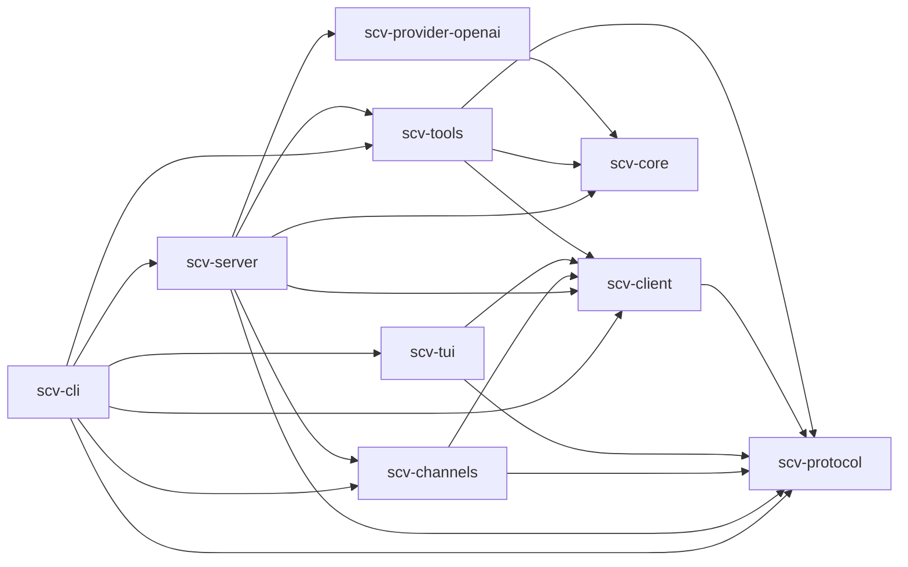

# SCV Architecture

SCV is a small Rust agent runtime with a terminal client. Its core is useful for
coding work, while its provider, context, tool, approval, and event interfaces
are general enough to host other kinds of agents.

## Dependency diagram

Arrows show compile-time dependencies from a crate to the crate it uses, as
`cargo metadata` reports them (development-only dependencies are left out).
Runtime socket connections are described below and do not add a
client-to-server crate dependency. Any change to an internal dependency
updates this diagram in the same commit.

## Product boundary

SCV provides:

- a provider-independent agent loop with bounded tool iterations;
- an OpenAI-compatible Responses API provider, with image input when the
  provider configuration allows it;
- configurable, deterministic context budgeting and compaction;
- built-in `read`, `read_skill`, `write`, `bash`, `web_fetch`, and
  `web_search` tools, plus the provider's hosted web search when configured;
- delegation through one `agent` tool, whose `agent` argument names another
  agent CLI (`claude`, `codex`, `grok`, `dsh`, `pi`) or a nested SCV (`scv`),
  in the foreground or as background jobs (`agent_wait`, `agent_status`,
  `agent_cancel`);
- a versioned newline-delimited JSON protocol;
- one Unix-socket daemon that owns agent state and per-connection sessions;
- a TUI and chat channel bridges (WeChat, Feishu/Lark) that attach to the
  daemon through the same protocol, including media in both directions
  (`chat_attach`);
- interactive approval for tools with filesystem, shell, subprocess, or
  network side effects;
- planned restarts into a newly installed release, with a binary rollback;
- yes/no questions to the owner in chat before irreversible steps, such as
  publishing SCV to crates.io (`scv confirm`);
- Linux and macOS source builds and release archives.

The current release does not include dynamic library loading, OS-level
sandboxing, session resume, provider login, syntax-highlighted diffs, or
feature parity with mature coding agents. Those features may be added without
moving policy or model-provider code into the TUI.

## Workspace layout

The repository is one Cargo workspace with these packages:

| Package | Responsibility |
| --- | --- |
| `scv-protocol` | Wire messages, the protocol version, and the bounded line framing (`FrameDecoder`) every connection uses. It contains no runtime policy and does no I/O. |
| `scv-client` | The instance layout (`Layout`: every path under `SCV_HOME`, the daemon socket among them, and the instance's service unit name), framed reading and writing (`Connection`, `read_frame`), private instance files (`fs::replace_private`), `Secret` values that never print, byte-bounded text, the delegation-depth variable, and a bounded daemon control helper whose failures are a typed `ControlError`; depends on protocol, not server. |
| `scv-core` | Agent loop, conversation model, provider/tool/context traits, approvals, and event sink. |
| `scv-provider-openai` | Streaming OpenAI-compatible Responses transport. |
| `scv-tools` | Workspace-scoped file tools, shell execution, native-agent delegation, and the credential files each delegated agent CLI reads (`stores`). |
| `scv-server` | Configuration, session lifecycle, component supervision, protocol dispatch, cancellation, approval routing, and event serialization. |
| `scv-tui` | Terminal state, rendering, input editing, scrolling, approvals, socket client, and headless stdio client. |
| `scv-channels` | The chat channels. The bridge they share: the `Channel` trait the daemon runs accounts through (`ChannelKind`, `Accounts`, `run`), the internal `Transport` each platform implements, durable claims and delivery state, held replies, per-conversation daemon sessions and limits, owner-only answering and remote tools, background reports, and the `hub` the daemon shares with running accounts (owner work, chats' sessions, notices, questions to the owner, restart context). Behind Cargo features, both on by default: `wechat` (iLink authentication, polling, and sending, and its credentials) and `feishu` (app registration by QR scan, the event long connection with catch-up from chat history, sending, and its credentials, for Feishu and Lark). |
| root `scv-cli` package | Installable `scv` and `scv-server` binaries. `src/main.rs` selects the instance and starts the runtime; each command group lives in `src/cli/`, including the administration only the command line does: signing agents in and importing their setups (`agents/`), `scv config show` (`config/overview.rs`), the systemd unit (`service.rs`), and terminal prompts (`prompt.rs`). |

The integration dependency chain is
`server -> channels -> client -> protocol`.
The TUI depends on client and protocol, never server. Tools and providers depend
on core, and tools also on protocol, whose wire types the `scv` agent speaks
to a nested SCV; core contains no concrete transport, provider, tool, server, or TUI
dependency. Protocol remains dependency-light. All packages share version
`0.3.0` and exact workspace dependency pins.

## Finding your way

Start reading in this order:

1. `scv-protocol`: `ClientMessage` and `ServerEvent`, everything a client and
   the server say to each other.
2. `scv-core`: the `Tool` and `Provider` traits and `AgentRuntime::run_turn`,
   the loop described under [Agent loop](#agent-loop).
3. `scv-server`: `connection::run_managed`, one connection's message loop
   with a handler per `ClientMessage`, and `session::turn::TurnStarter::start`,
   which runs a turn.
4. `scv-tools` (`registry.rs`): `builtin_registry`, which decides the tools
   a session gets.
5. `scv-channels`: `channel.rs`, the `Channel` trait and `run`, which the
   daemon calls for each chat account, then `lib.rs`, the `Transport` trait
   and the bridge every account runs.

A TUI turn: `scv-tui` sends `turn.start` over the daemon socket; the server's
`run_managed` hands it to `Connection::turn_start`, which queues it or has
`TurnStarter::start` run `AgentRuntime::run_turn`
with `OpenAiProvider` and the session's `ToolRegistry`. A tool that needs
approval becomes an `approval.requested` event through `ProtocolApprovalGate`,
and the client's `approval.resolve` answers it. Core events become
`ServerEvent`s in `ProtocolSink`, which the TUI applies in
`App::handle_server_event` and draws.

A WeChat message: the WeChat transport's `receive` returns it to the bridge
that `scv_channels::run` started, which classifies it (`intake::classify`),
claims it durably, and hands it to the conversation's
`channels::session::Session`, a daemon session on the same socket. The turn then runs exactly like the TUI's, and the bridge sends the
final answer back through the transport's `send`. Feishu differs only in its
transport.

What lives where in the largest crates:

| Crate | Module | Contents |
| --- | --- | --- |
| `scv-server` | `lib.rs` | Module list and the public API (`run_socket`, `run_stdio`, `config`, build info, the restart watchdog) |
| | `daemon.rs` | The socket listener and its lock, `run_stdio`, and reconciling delegated runs |
| | `connection.rs` | One connection: bounded frame reading and a handler per `ClientMessage` |
| | `control.rs` | `daemon.control`: status, components, delegations, scheduled restarts, and questions to the owner |
| | `outbound.rs` | The byte- and frame-bounded outbound queue and event encoding |
| | `session/` | A session (`mod.rs`), building one (`build.rs`), its turn queue (`queue.rs`), and running a turn (`turn.rs`) |
| | `prompt/` | The system prompt (`mod.rs`) and skill discovery (`skills.rs`) |
| | `approval.rs`, `events.rs` | Approval gates, and `CoreEvent` to `ServerEvent` |
| | `config/` | The schema (`schema.rs`), layered loading (`load.rs`), validation and the limits table (`validate.rs`), and runtime settings (`runtime.rs`) |
| | `components.rs` | `Component`, `HealthReporter`, `Supervisor`, and the channel accounts they run |
| | `restart.rs` | [Planned restarts](#planned-restarts), the watchdog, and the notifier that finds the owner's chat |
| | `confirm.rs` | [Questions to the owner](#questions-to-the-owner) (`scv confirm`) |
| | `attachments.rs` | Files attached to a turn, such as chat media |
| `scv-tools` | `registry.rs`, `config.rs`, `args.rs` | `builtin_registry`, the tools' settings, and the argument helpers every tool shares |
| | `builtin/` | Tools that run inside SCV: `fs.rs` (`read`, `write`), `skill.rs` (`read_skill`), `shell.rs` (`bash`), `web.rs` (`web_fetch`, `web_search`), `chat_attach.rs` |
| | `process.rs` | Spawning a child in its own process group, draining its output, and `ProcessGroup`, the only way SCV signals a group |
| | `delegate/agent.rs`, `delegate/request.rs` | The `agent` tool, which chooses the agent, checks the call against what it takes, and hands it to that agent's backend, and the arguments every call takes |
| | `delegate/native.rs` | The per-turn CLI backend |
| | `delegate/acp/`, `delegate/scv.rs`, `delegate/live.rs` | Long-running delegations over ACP (`rpc`, `session`, `permission`, `progress`, `tool`) and the SCV protocol, on one live-child runtime |
| | `delegate/adapters.rs`, `delegate/choice.rs` | One descriptor per delegated agent CLI, and how the `agent` tool describes each agent and names the others after a failure |
| | `delegate/background.rs`, `delegate/conversation.rs`, `delegate/records.rs` | Background jobs, multi-turn conversations, and records of running delegations (public as `scv_tools::delegation`) |
| | `delegate/output.rs`, `delegate/progress.rs` | Reading a delegated CLI's output and progress |
| | `delegate/stores.rs` | Each agent CLI's credential files in its native format (Codex and Grok imports, API keys, pi and nested-SCV endpoints), public as `scv_tools::stores` |
| `scv-channels` | `channel.rs` | The `Channel` trait, `ChannelKind`, `ChannelCredentials`, `Accounts`, and `run`, through which the daemon and CLI reach every channel |
| | `lib.rs`, `intake.rs`, `session.rs` | The bridge, what it does with each received message (`classify`: ignore, busy, a turn, or the owner's answer to a question), and a conversation's daemon session |
| | `state.rs`, `hub.rs`, `media.rs` | Durable account state, what the daemon shares with running bridges, and chat media |
| | `retry.rs` | `Backoff` for polling and redelivery, and `retry_send` for one outbound request |
| | `wechat/` | WeChat login, polling `getupdates`, and sending (`mod.rs`); iLink requests (`ilink.rs`); credentials (`credentials.rs`); CDN files, AES-encrypted both ways (`cdn.rs`) |
| | `feishu/` | The Feishu transport (`mod.rs`) and its Open Platform client (`api.rs`); the event long connection, its protobuf frames, and parsing events and catch-up history (`socket.rs`, `frame.rs`, `inbound.rs`); signing in by QR scan or with an existing app (`login.rs`); credentials (`credentials.rs`) |
| `scv-core` | `message.rs`, `tool.rs` | History messages; the `Tool` trait, its context and output, and `ToolRegistry` |
| | `provider.rs`, `event.rs`, `approval.rs` | The `Provider` trait, the events a turn reports, and the `ApprovalGate` |
| | `progress.rs` | Bounded, paced tool progress lines |
| | `context.rs`, `history.rs` | Choosing the history that fits the context window, and trimming stored history |
| | `runtime.rs` | `AgentRuntime` and its turn loop |
| `scv-protocol` | `client.rs`, `server.rs` | `ClientMessage` and `ServerEvent` |
| | `daemon.rs`, `attachment.rs`, `background.rs` | Daemon control and status, attached files, and background-job reporting |
| | `error.rs` | `ErrorCode` (why a request or turn failed) and `ToolErrorKind` (why a tool call did) |
| `scv-provider-openai` | `request.rs` | `OpenAiProvider`: requests, retries, and error reporting |
| | `stream.rs`, `wire.rs`, `encode.rs` | Assembling a response from its event stream, the wire shapes, and replaying history as input |
| `scv-tui` | `app.rs`, `transcript.rs` | What the UI shows and how server events change it; bounded transcript and prompt history |
| | `input.rs`, `render.rs`, `terminal.rs` | Keys and the composer, drawing, and terminal setup |
| | `client.rs`, `exec.rs` | The server connection, and headless `scv exec` |

Black-box tests of the binaries are one test program, `tests/it/`, with a
module per area (`server`, `daemon`, `config`, `confirm`, `delegation`,
`restart`, `update`, and `feature_flow` for the landing skill's scripts) and
shared helpers in `tests/it/support.rs`.

Each channel account is a component hosted by the daemon's supervisor, which
hands it to `scv_channels::run` with an `AccountRun`: the instance layout,
the account's credentials and whole settings table, its owner (whether or not
the owner holds the tool grant), the owner turn timeout when it does, the
workspace, the daemon socket, the hub link, and a health callback; the
supervisor cancels the run by dropping it. Each channel module (`wechat`,
`feishu`) implements `Channel`, which signs in and runs an account, and the
crate-internal `Transport`, which receives a batch of messages after a
checkpoint and sends one part of a message. A transport may also name a label
for the messages SCV writes itself, as WeChat's does (`system msg: `); the
bridge then puts such a message, label first, in a Markdown code block when
it queues it, and never marks the model's answers. A push transport such as
Feishu's acknowledges a batch when the bridge asks for the next one, which it
does only after the batch's claims and checkpoint are durable. The shared
bridge does the rest for every channel. It speaks the versioned protocol over
the daemon socket, using one long-lived session per remote sender (and per
group and sender in group chats). An account answers only its authenticated
owner unless its `senders = "anyone"` setting opens it to every sender. Sessions
are tool-free unless the account's `remote_tools = "owner"` setting grants the
authenticated owner's direct chats full, auto-approved tools.
Session policy, history, queueing, cancellation, and approvals remain
authoritative in `scv-server`. See [`channels.md`](channels.md) for its API,
storage, delivery, and safety contract.

The daemon and stdio endpoint share the same server implementation. The
Unix-socket daemon is the normal long-running backend; the stdio endpoint is a
one-session local transport for embedding and headless commands. TUI and
channel connections create independent sessions, so provider and model
overrides are resolved at `session.start` without restarting the daemon.

## Runtime topology

The Unix-socket daemon owns one independent session and ordered queue for each
client connection. The default `scv` TUI attaches to that socket and reports a
clear not-started error when no daemon is listening. `server --stdio` remains
available for one-shot local clients such as `scv exec`.

Each `session.start` request can carry provider, model, and base-URL overrides.
The daemon resolves those values when creating the session, so model/provider
selection can change between TUI clients without restarting the daemon or
mutating another session's runtime. Queue state survives neither client
disconnect nor server restart.

The managed daemon is started as a user-level systemd service and defaults to
the `on-risk` approval policy. `scv start --allow-sudo` may authenticate the
current user's existing sudo policy before the service starts, but SCV does not
modify sudoers or elevate the daemon itself. A start without verified sudo
authorization is confirmed interactively, or rejected when no terminal is
available.

`scv update` installs the latest CLI from the configured Cargo index and
restarts an active user daemon through systemd; a release landed through the
feature flow restarts through a planned restart instead (below). The socket closes as the old
process exits; TUI clients retry the socket and establish a new session after
the replacement daemon is ready. Canonical history and the queue belong to the
old server session and are not restored. The TUI never automatically replays
submitted work. A foreground `scv run` daemon requires an explicit restart
after installing the published binary.

## Planned restarts

`scv-server::restart` lets a daemon restart into a release installed at its
own executable path without cutting off the work that asked for it, such as
an owner's chat request to change, publish, and deploy SCV itself.

1. `scv restart --when-idle` (the feature-flow `deploy.sh`, after `cargo
   install`) sends `restart_when_idle`. The daemon must run in its systemd
   unit's cgroup, and the installed binary must answer `scv build-info`
   (version and `CONFIG_LAYOUT`); otherwise nothing is scheduled.
2. The daemon saves a plan in `$SCV_HOME/state/update.json` (mode 0600) and
   waits, checking every second. It goes ahead after two clear checks in a
   row: the delegation named by the request's `SCV_PARENT` chain is no longer
   at work, its daemon session has no running turn, running or unreported
   background job, and (through the channel hub) no unstored report; and no
   chat bridge holds an owner message it has not answered durably. A
   per-turn CLI run is at work while it has live processes. A live child (a
   nested SCV or an ACP agent) keeps its process for its whole conversation,
   so it is at work only while a turn runs on it (`idle_since_unix` is absent
   then) or, for a nested SCV, while background jobs of its own session still
   run or wait to be reported to its model (`background_jobs`), which its
   delegation record tells (`DelegationEntry::working`). At the request's
   deadline it goes ahead anyway and the plan says so.
3. It records the accounts connected at that moment, copies its own image
   (`/proc/self/exe`) to `<binary>.prev`, and starts `scv restart-watchdog`
   from that copy as a transient unit (`systemd-run --user`), outside its own
   cgroup.
4. The watchdog restarts the unit and waits up to 180 seconds for the daemon
   to report the new version with every recorded account connected. When it
   does not, and both releases declare the same `CONFIG_LAYOUT`, it puts
   `<binary>.prev` back over the binary and restarts again (a binary-only
   rollback); across layouts it refuses. It records `verified`,
   `rolled_back`, or `failed` in the plan.
5. The next daemon reads the plan before any account starts. Each account's
   first recovery then answers messages the restart interrupted with "SCV
   restarted to update to vX before finishing this" and tells each direct chat
   which of its background jobs stopped. Once the watchdog's outcome is in the
   plan, the daemon announces it to the chat that asked, or through the notify
   targets when that chat does not connect within two minutes, then removes
   the plan.

`CONFIG_LAYOUT` names how configuration and state are laid out; a release that
changes them so the previous release cannot read them bumps it. The daemon
also keeps `$SCV_HOME/state/daemon.json` while it runs; finding one left by
another process at startup means the previous daemon stopped without shutting
down, which the owner is told through the notify targets.

Notices nobody asked for (an update started from a terminal, a rollback, a
restart after a crash, an account disconnected for ten minutes) go to the
owner of the first connected account in the user configuration's
`notify.owner` list, on that account only; with no list, to the chat the owner
last wrote from (`$SCV_HOME/state/last-owner.json`), and otherwise only to the
log. `scv_channels::hub::Hub` carries what the daemon and its bridges share:
each running account's owner and outbox, which daemon session each direct chat
runs on and its unreported background work, claimed owner messages, the
owner's last chat, questions waiting for the owner's answer, and whether this
start is a planned restart. `scv_tools::delegation::DelegationRegistry::own_run`
reads an `SCV_PARENT` chain for both planned restarts and questions: which of
the daemon's own delegations the caller runs inside, and its session.

## Questions to the owner

`scv-server::confirm` asks the owner yes or no before a step that cannot be
undone; the feature-flow `publish.sh` asks before publishing SCV to crates.io
when SCV delegated the flow.

1. `scv confirm [--timeout SECS] QUESTION` sends `confirm_ask` with the
   caller's `SCV_PARENT` chain. The daemon finds the chat as a planned restart
   does (delegation, then its session, then through the hub the direct chat
   that session answers), or else asks the owner chat unprompted notices go
   to (`Notifier::owner_chat`: the first connected `[notify].owner` account,
   or the owner's last chat). It must be an account owner's direct chat;
   otherwise nothing is asked.
2. The daemon holds the question in the hub under that chat (one per chat),
   replies with its ID at once, and queues the question's text in the
   account's durable outbox with `Hub::send_question`, a notice tagged with
   the question's ID, which the pending delivery keeps. The CLI follows it
   with `confirm_status` every two seconds, since one control request is
   capped at 20 seconds; a question nobody follows for a minute is withdrawn.
3. The bridge delivers the outbox in order. Once the platform accepts the
   question's text, the bridge records the delivery time in the hub
   (`Registration::question_delivered`), which opens the question; a refusal
   fails it (`question_undelivered`), and text whose question no longer
   waits is dropped unsent.
4. The bridge's `classify` returns `Verdict::Answer` for the owner's explicit
   yes or no in that direct chat, sent (by the platform's message time,
   `Message::sent_ms`) no earlier than the question's delivery. The bridge
   takes the question from the hub, stores its acknowledgement as the
   message's reply, and only then hands the answer over; no turn starts.
5. The daemon records the answer, or at the deadline withdraws the question:
   one the chat saw is told that no answer counts as no, and one never
   delivered fails without a word to the chat. `scv confirm` exits 0 on yes,
   1 on no or no answer, and 2 when nothing could be asked or the answer was
   not learned.

Questions live in memory only: a restart drops them, and the waiting CLI,
finding the question unknown or the daemon gone, exits 2.

## Component lifecycle

`scv-server::components` owns `Component`, `HealthReporter`, and `Supervisor`.
`Component::run(cancel, HealthReporter)` must observe cancellation and must not
detach child tasks. The supervisor starts at most one instance per account,
retries unexpected exits with exponential backoff from 1 to 60 seconds, and
cancels, aborts if necessary, and joins work within bounded shutdown.
All future long-running components must use this server-owned lifecycle.

The daemon discovers saved channel accounts on startup and reconciles every
two seconds or immediately on `scv reload`. Each account is the component
`<channel>:<account>`. Login is explicit; saved accounts
autostart unless their `[channels.<channel>.<account>]` table in `config.toml`
disables them. Each account's optional
workspace defaults to the daemon workspace. Credential or settings replacement
stops and joins the old instance before starting its replacement. Logout
requires a live daemon, disables and joins the component, then removes its
credentials, delivery state, and settings table.

Reconciliation runs in a separate cancellation-aware task, leaving the listener
free to accept connections. `state::account_snapshot` reads credentials and
settings together under the account transaction lock. Delivery state is bound
to identity and normalized API origin; same-identity token rotation preserves
state, while changing the binding requires logout. Unknown legacy identity uses
a conservative token-based fingerprint. The lifetime runner lock and short
mutation lock are nonblocking, and no network I/O holds the mutation lock.
A busy account snapshot defers reconciliation without stopping the running
instance.

SIGTERM and Ctrl+C stop acceptance, cancel components and tracked session tasks,
and join them with bounded cleanup. A `TaskTracker` retains session writer and
turn tasks through forced connection-handler aborts; abort guards and turn
cancellation ensure descendants stop, and shutdown waits for their completion.
The stdio endpoint does not host components.
Management uses `daemon.control` and `daemon.status` on the daemon socket through
`scv-client`; it does not require an agent session. Status reports the running
server PID/version, account identity, component state, last successful contact,
restart count, and sanitized errors. Credentials are not connection evidence.
The component management lock is released before writing the response, so a
nonreading management client cannot prevent reconciliation or shutdown.

Delegated agent runs are tracked by `scv_tools::delegation`. Each SCV process
(the daemon or a `scv server --stdio`) holds one `DelegationRegistry` for its
instance, and every session's agent backends record their runs in it through
`ToolsConfig.delegation`, which carries the registry and the session ID.
Records live in `$SCV_HOME/state/delegations`, so the daemon also sees runs that
`scv exec` servers started. A separate daemon task reconciles them at startup
and every 60 seconds, stopping orphans, and collects exited orphan processes;
on Linux the daemon is a child subreaper. `delegations` and `delegation_kill`
control actions serve `scv agents ps` and `scv agents kill`. A session whose
client declares `session.start.delegation_depth` (a delegated client) counts
its runs from that depth when it exceeds the process's own.

Live delegations keep one child for a whole conversation. `delegate/live.rs`
holds the protocol-neutral part: `LiveChild` starts the child in its adapter
environment and own process group, records it as a delegation, frames its
stdout into bounded lines, and shuts it down (stdin closed, a 2-second grace,
then a group kill and a sweep of tagged processes). Each call that runs a
turn on the child holds `LiveChild::begin_turn`'s guard, and the record
notes when the turn ended (`idle_since_unix`) once the guard drops, however
the call ends, so `scv agents ps` lists the child idle between turns and a
planned restart does not wait for it then, unless a nested SCV's own
background jobs still count (below). The conversation store
keeps the child as the conversation's attachment, so forgetting, expiring, or
ending the conversation's session is what shuts it down. `delegate/scv.rs`
runs the SCV protocol client on top of it for the `scv` agent. A nested SCV's
session can run background jobs that outlive the call that started them and
are reported in turns the nested SCV starts itself, so between calls a
watcher task keeps reading its events. The nested SCV never stalls on a full
pipe, approval requests of its own turns are denied (no call is there to
carry them to a person), and the record counts the nested session's jobs
that still run or wait to be reported (`background_jobs`), which keeps the
child at work between turns. As for a chat session, a job counts from the
`tool.completed.jobs` entry of the call that started it until the nested
model sees its result, through a later call or a report turn
(`origin.jobs`), which counts until it ends. An ACP agent has no such jobs
in its protocol, and nothing reads from it between turns. `delegate/acp/`
runs an Agent Client Protocol (JSON-RPC 2.0) client on the same runtime for
the agents whose adapter-table entry names an ACP server
(`AcpLaunch`). The server resolves `[agents.<name>] transport` into an
`AcpAgentLaunch`, and the registry offers the agent on its ACP backend when
that server is installed, otherwise on the per-turn CLI backend. Tools reach
the session's approval
gate through `ToolContext.approvals`, which carries the running call's ID, so a
nested agent's approval requests are decided like the session's own.

Background delegations live in `scv_tools::background`. Each session owns one
`BackgroundJobs` store, shared by its tools and dropped with the session,
which cancels the jobs still running. When `agent.max_background` is positive
the registry wraps the `agent` tool in `BackgroundCapable`: a call with
`background: true` has the tool choose and check its agent, then starts the
tool's `execute` in a detached task with
its own cancellation token, a buffered progress sink, and the session's
unattended approval gate (the policy's own decision, else the client's
declared `auto_approve`, else a denial), and returns a job handle;
`agent_wait` and `agent_status` read the store and `agent_cancel` cancels one
job's token. The store records a `JobChange` under the call's ID
(`ToolContext.call_id`) when a call starts a job and when a call first shows
the model a job's result or stops it; `ProtocolSink` takes them
(`take_changes`) into that call's `tool.completed.jobs`, so clients learn
which jobs run from typed events rather than from prompts or tool output.
Agent results are read back through one typed `AgentReply`
(`delegate/output.rs`). Beneath it, `AgentTool` (`delegate/agent.rs`) is the
one tool the model sees for delegation: its `agent` argument is an enum of the
offered agents, and it routes each call to that agent's `Backend` (native,
ACP, or nested SCV), taking the agent from a `session` handle, the argument,
or the first offered `agent.prefer`, and refusing an option the agent does not
take before anything launches. `delegate/choice.rs` writes each agent's line
in the argument's description (product, what it offers, what it takes, the
user's `use_for` and any default `model`/`effort` for that work) and names the
other offered agents on availability failures. A
finished job wakes the connection loop, which, once the session is idle and
its queue empty, starts a turn of its own (`TurnStarter::report_background`)
whose prompt reports the jobs the model has not seen yet; its events carry a
`TurnOrigin` naming those jobs. The channel bridge and `scv exec` track a
session's jobs from `tool.completed.jobs` and report turns' `origin.jobs`;
the bridge routes report turns by `request_id`, keeps a session with running
jobs open (and exempt from eviction), and sends their answers as unprompted
messages. The system prompt's delegation and chat-channel sections
are built after the registry, from the agents its `agent` tool actually offers and the
`channel` the client declared.

A live child (`LiveChild` in `delegate/live.rs`, behind the ACP and nested-SCV
transports) is owned by a reaper task that waits on the process from the
start, so a child that exits between turns, by itself or through `scv agents
kill`, is collected at once, its group stopped, and its delegation record
removed.

## Agent loop

For each user turn, the server-owned session performs this sequence:

1. Append the user message to the full session history.
2. Ask the configured context policy for the model-visible history.
3. Send the system prompt, selected history, and current tool schemas to the
   provider.
4. Emit assistant text deltas while accumulating the canonical assistant
   message, then append that complete message.
5. If the message contains tool calls, approve and execute them in call order,
   append their bounded results, and return to step 2. While a tool runs, the
   lines it reports to `ToolContext.progress` are forwarded as `ToolProgress`
   events at most every 500 ms; they are display-only and never enter the
   history.
6. Finish when the provider returns no tool calls. Cancellation produces a
   cancelled terminal event; provider, invariant, and configured resource-limit
   failures produce a failed terminal event.

If `agent.max_steps` is reached before a final response, the loop stops before
another provider request and reports `step_limit` without executing more work.

A tool failure is a model-visible tool result rather than a server crash. A
provider, protocol, or invariant failure ends only the current turn when
possible. The provider retries transient failures only before any output has
streamed, and reports every other error, including an error event or a stream
that ends before completion, as a failed turn rather than an empty answer. Canonical history is bounded by session byte and message limits.
Before a limit is reached, the server replaces the oldest complete groups with
one bounded deterministic history note and emits `session.trimmed`. It never
splits an assistant/tool group. If the active turn alone cannot fit, the turn
fails with `history_limit`. Any failed or cancelled turn restores its pre-turn
history snapshot, so canonical history never retains a partial or oversized
active group.

## Extension surface

Rust traits are the stable internal extension seam:

- `Provider` converts a model request into one assistant message and usage;
- `Tool` publishes a JSON schema, an approval risk, and asynchronous execution,
  and may report status lines through the `ProgressSink` in its context. A
  call that cannot run returns a `ToolError` and a result that failed carries
  its `ToolOutput::failure`, both typed by `ToolFailure` (denied, cancelled,
  invalid arguments, unavailable, limit, failed, unknown tool); the model
  reads only the text, and the server reports the kind to clients as
  `tool.completed.error`. scv-core names no wire codes: the server maps
  `ToolFailure` and `AgentError` to the protocol's `ToolErrorKind` and
  `ErrorCode` in `events.rs`;
- `ContextPolicy` selects or compacts model-visible history;
- `ApprovalGate` resolves side-effecting work;
- `EventSink` receives typed lifecycle events.

`ToolRegistry` accepts built-in or downstream `Arc<dyn Tool>` values without
changes to the loop. `AgentRuntime` is constructed from trait objects so another
binary can embed SCV with different providers, policies, and tools.

Process extensions use the same internal adapter behind the `claude`,
`codex`, `grok`, `dsh`, and `pi` agents of the `agent` tool. Adapters are
declarative: one `scv_tools::adapters` descriptor per CLI holds its
executable-plus-argument templates, its state location inside the private
home, the variables it must not inherit, and how `scv agents` signs it in. SCV does not load third-party dynamic
libraries because Rust has no stable dylib ABI and in-process plugins
would share all of SCV's authority.

Skills are Markdown instruction packages discovered from `.scv/skills/*/SKILL.md`
and the configured user skill directory. The loader exposes their name and
description in the system prompt. The model loads an applicable skill by name
through `read_skill`, which resolves only the immutable discovery map and checks
containment under the configured skill roots. A skill does not gain authority
beyond the tools and approvals available to the session.

Repositories carry their own agent skills in `.agents/skills` (Codex) and
`.claude/skills` (Claude Code). SCV does not execute or translate them: in
tool-enabled sessions it lists those of the workspace and its immediate child
projects as `<project>:<name>` so the model knows they exist, and delegates the
work with an `agent` call whose `cwd` is that project. The nested CLI then
discovers the project's instructions and skills natively, so new repositories
and skills need no SCV registration.

## Provider boundary

### Instance configuration boundary

An SCV process owns one immutable instance root selected by `--scv-home` or
`SCV_HOME` (default `~/.scv`). The root is the namespace for configuration,
socket, service unit identity, skills, credentials, channel state, and nested
agent state, laid out by `scv_client::Layout` as `config.toml`,
`credentials/`, `agents/`, `skills/`, and `state/` (see
[instance layout](configuration.md#instance-layout)). Each binary's `main`
resolves the root once with `Layout::from_env`, right after applying
`--scv-home`/`--config` (canonical when it exists, so the unit name and
delegation records hash the same path in every process), and passes the
`Layout` down explicitly: the server (`run_socket`, `run_stdio`, `Config::load`,
the components and planned restarts), the delegation registry, the channels
(`Accounts`, `AccountRun`), and the TUI (its socket path). No library reads
`SCV_HOME`; the environment only carries the selection to child processes (the
systemd unit, the restart watchdog, and delegated agents), and every crate
takes its paths from `Layout` rather than joining its own. `--config`/`SCV_CONFIG`
selects an explicit additional config layer for that instance, which the
server receives as `ConfigOverrides::config_file`. Custom roots never fall back to the default user
configuration, allowing forked SCV processes to choose different providers and
models without sharing mutable state. The systemd launcher persists the
selectors and `scv update` restarts only the selected instance.

Native agent adapters receive a derived private home under
`<instance>/agents/<name>`. Codex receives the matching `CODEX_HOME`; SCV
also removes SCV selector variables from the child environment. This prevents
an SCV adapter from reusing or changing the user's normal Codex configuration.

The built-in provider uses the OpenAI-compatible `/responses` endpoint and
function-tool schema. It assembles streamed tool-call arguments and validates
the final JSON before returning a call to the loop. Requests are stateless: each
one replays the conversation, with every earlier tool call sent as a
`function_call` item before its `function_call_output`. A call whose turn was
cancelled before it returned is closed with a failed output, so the replayed
history always pairs calls with results as the API requires. Function tools are
sent with `strict: false`: SCV schemas leave optional fields out of `required`,
and strict mode, the Responses default, would make the model fill every one of
them, such as an unrequested `model` or `effort` for a delegated agent.

The base URL, API-key environment variable, model, and timeout are
configuration. API keys are read from the environment and never accepted in
project configuration.

The core `Provider` trait does not expose HTTP types. Native Anthropic,
Responses API, local-model, streaming, and subscription-auth providers can be
added independently.

## TUI contract

The TUI keeps no authoritative conversation or tool state. It connects to the
daemon socket, renders server events, and sends protocol commands. Its current
interaction contract is:

- a persistent transcript, multi-line composer, status line, and model/context
  footer;
- `Enter` to submit and `Ctrl+J` to insert a newline;
- `Esc` to cancel the active turn and `Ctrl+C` to clear input or quit when the
  input is empty;
- `PageUp`/`PageDown` scrolling;
- visible, collapsible tool lifecycle rows with bounded result previews;
- an explicit `y`/`n` approval prompt that includes the tool name, risk, working
  directory, and summary;
- prompt history and `/help`, `/clear`, `/context`, and `/quit` local commands;
- terminal restoration after normal exit, errors, panics, and child shutdown.

Queued steering, file completion, session trees, model pickers, images, themes,
and rich Markdown are follow-up UX layers on the same event protocol.

## Portability and installation

The supported source toolchain is stable Rust 1.88 or newer. Runtime code uses
portable Rust APIs plus `/bin/bash` on Linux and macOS. The release
matrix builds `aarch64` and `x86_64` archives for both operating systems.

The primary installation path is crates.io (`cargo install scv-cli
--locked`), which `scv update` also uses; a GitHub Release archive and
`cargo install --locked --git <repository-url>` also work. The root package
installs both executables. SCV does not modify shell profiles or install
provider CLIs.

## Verification and performance budgets

Every change must pass `cargo fmt --check`, `cargo clippy --workspace
--all-targets --locked -- -D warnings`, `cargo test --workspace --locked`, and
`git diff --check`. Protocol and tool safety behavior require unit or
integration coverage.

Release delivery also requires `cargo build --release --locked` and the
dependency checks documented in `quality.md`.

The full correctness and performance plan is defined in
[`quality.md`](quality.md). Tests use scripted providers and fake executables;
they never require a live API key or an installed delegated agent.

The benchmark harness measures operations SCV controls rather than provider
latency. On a release build and warm filesystem, the targets are:

- context selection over 10,000 small messages: under 20 ms;
- protocol encode/decode round trip: under 100 microseconds per message;
- release binary startup through protocol initialization: under 150 ms on a
  contemporary developer laptop, reported as an observed value rather than a
  cross-machine test failure.

Benchmarks use Criterion where statistical sampling is useful. Manual release
smoke measurements cover process startup, first paint, and memory. CI checks
correctness; performance results are recorded for regression comparison because
shared runners are noisy.

## Reference baseline

SCV's boundaries are informed by primary project documentation:

- [Codex app-server protocol](https://github.com/openai/codex/blob/main/codex-rs/app-server/README.md)
  demonstrates a typed, bidirectional server boundary for multiple clients.
- [Codex protocol crate](https://github.com/openai/codex/blob/main/codex-rs/protocol/README.md)
  keeps protocol types light and free of material business logic.
- [Pi coding agent](https://github.com/earendil-works/pi/blob/main/packages/coding-agent/README.md)
  demonstrates a small default toolset, multiple runtime modes, session context
  compaction, and a terminal-first interaction model.
- [Pi extensions](https://github.com/earendil-works/pi/blob/main/packages/coding-agent/docs/extensions.md)
  demonstrates tool registration and lifecycle interception as explicit
  extension surfaces.
- [Claude Code documentation](https://code.claude.com/docs/en/overview)
  is the UX reference for visible tool activity, interruption, permissions,
  project instructions, and terminal-centered workflows.

These are behavioral and architectural references. SCV contains no copied
source code from them.

User configuration supports named provider profiles with per-profile endpoints,
credentials, and headers; project configuration cannot redirect that trust
boundary.
